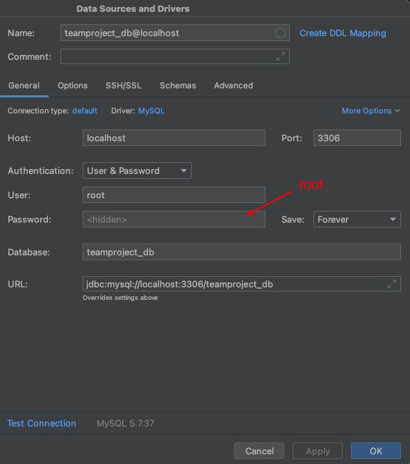

**This is the Backend for the Project Metaproject.**

In the folder main/resources you will find dumps and application properties. 
- You can use the dumps to create your local databases for testing
- In the application properties file are important properties of the project stored. 
  - We have multiple files, because we use [profiles](https://www.baeldung.com/spring-profiles ) to work in differen environments.

